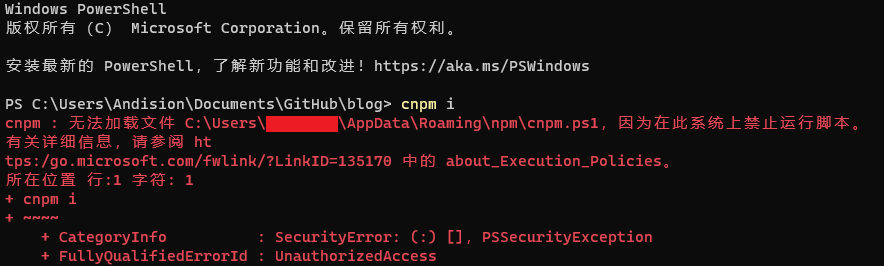
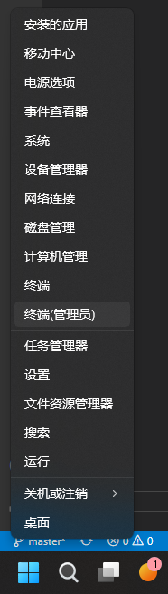

# 前言

在Windows系统的终端中使用npm相关的脚本，终端有如下错误提示

```
cnpm : 无法加载文件 C:\Users\Andision\AppData\Roaming\npm\cnpm.ps1，因为在此系统上禁止运行脚本。有关详细信息，请参阅 https:/go.microsoft.com/fwlink/?LinkID=135170 中的about_Execution_Policies。
所在位置 行:1 字符: 1
+ cnpm i
+ ~~~~
    + CategoryInfo          : SecurityError: (:) []，PSSecurityException
    + FullyQualifiedErrorId : UnauthorizedAccess
```

<!-- 
 -->
 

# 解决方案

1. 使用管理员身份运行终端或PowerShell，一种快速的方法是鼠标右键任务栏中的Windows图标，Windows 10 系统选择`PowerShell（管理员）`，Windows 11 系统选择`终端（管理员）`。

    
    <!--  -->

2. 在管理员身份运行的终端或PowerShell中输入如下内容并回车。

    ```
    set-ExecutionPolicy RemoteSigned
    ```

3. 重启终端或PowerShell，即可正常使用。

# 问题分析

> PowerShell 执行策略是一项安全功能，用于控制 PowerShell 加载配置文件和运行脚本的条件。 此功能有助于防止恶意脚本的执行。
> 
> 在 Windows 计算机上，可以为本地计算机、当前用户或特定会话设置执行策略。 还可使用组策略设置为计算机和用户设置执行策略。
> 
> 本地计算机和当前用户的执行策略存储在注册表中。 无需在 PowerShell 配置文件中设置执行策略。 特定会话的执行策略仅存储在内存中，并在会话关闭时丢失。
> 
> 执行策略不是限制用户操作的安全系统。 例如，当用户无法运行脚本时，用户可以通过在命令行键入脚本内容来轻松绕过策略。 相反，执行策略可帮助用户设置基本规则，并防止他们无意违反这些规则。
> 

通过查阅错误信息中的网址，我们可以得知，Windows客户端默认采用`Restricted`策略。该策略只允许单个命令，但不允许脚本。因此，我们将策略设置成较为宽松的`RemoteSigned`即可。各种策略及其对应的安全要求可以查看[微软官方文档](https:/go.microsoft.com/fwlink/?LinkID=135170)中的详细介绍。