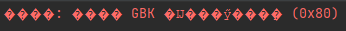
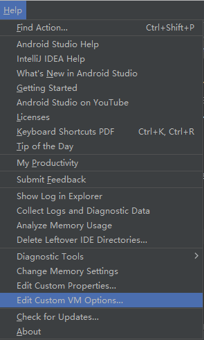

# 前言

在新电脑上安装Android Studio并编译应用时，Build日志输出了一些日志信息，但其中的中文显示为乱码`�`。



# 解决方案

1. 在Android Studio中选择`Help -> Edit Custom VM Options...`

    

2. 在打开的文件末尾添加如下内容

    ```
    -Dfile.encoding=UTF-8
    ```

3. 保存并重启Android Studio


# 问题分析

产生乱码的原因是，日志输出的信息包含了Android Studio不支持的字符编码（通常为汉字或特殊字符），添加UTF-8的编码格式可以解决该问题。